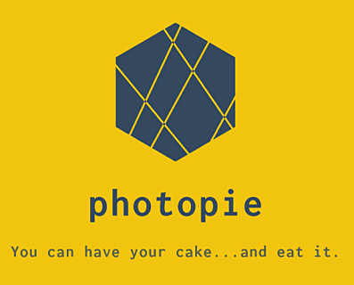

|Appveyor Status| |Codacy Badge| |Codestyle| |License: MPL 2.0| |contributions welcome| |HitCount|
|DOI Badge|

.. |License: MPL 2.0| image:: https://img.shields.io/badge/License-MPL%202.0-brightgreen.svg
   :target: https://opensource.org/licenses/MPL-2.0

.. |Appveyor Status| image:: https://ci.appveyor.com/api/projects/status/github/wizofe/PhotoPie?svg=True

.. |Codestyle| image:: https://img.shields.io/badge/code%20style-black-000000.svg
    :target: https://github.com/python/black

.. |contributions welcome| image:: https://img.shields.io/badge/contributions-welcome-brightgreen.svg?style=flat
   :target: https://github.com/dwyl/esta/issues

.. |HitCount| image:: http://hits.dwyl.io/wizofe/PhotoPie.svg
   :target: http://hits.dwyl.io/wizofe/PhotoPie

.. |Codacy Badge| image:: https://api.codacy.com/project/badge/Grade/82e16a8a705d4da3b8ccbdac91e22150
   :target: https://www.codacy.com/app/wizofe/PhotoPie?utm_source=github.com&utm_medium=referral&utm_content=wizofe/PhotoPie&utm_campaign=Badge_Grade

.. |DOI Badge| image:: https://zenodo.org/badge/187055678.svg
   :target: https://zenodo.org/badge/latestdoi/187055678

========
PhotoPie
========

Python + Photoshop = 🧡

PhotoPie is an Adobe Photoshop© compatible library, tested with versions CC 2017/CC 2018 (but it should be able to work in previous versions as well), Windows 7 and 10 and Python 2.7, 3.5+. More like the missing Python API for your art needs!

Releasing
---------

Planned ALPHA Release (0.1.0): **June 2019**. Keep the date.

Why?
----

Until today, Adobe offers only Javascript and Visual Basic Script (?!) for interfacing with Photoshop. Unfortunately both are not as easy to interface and widespread in the VFX/imaging world as much as Python. It was really frustrating to go myself through the bad documentation, describing some API calls, leaving a lot to be wished for.

That's why I decided to write ``PhotoPie``! A user-friendly library, wrapping the Windows calls from Photoshop using ``comtypes``.

As an example, to create a new

Development
-----------

Tools to be used in the development phase

- Packaging: ``poetry``
- CI: ``Appveyor``
- Testing: ``pytest``, ``tox``
- Documentation: ``sphinx``, ``read the docs``, 
- Coding Style: ``black``
- Contributing: `poetry guidelines <https://poetry.eustace.io/docs/contributing/>`_
- Glue: `dephell <https://github.com/dephell/dephell>`_

References
----------

In the scientific community and important element is the 'References' or stepping on the shoulders of giants. 
Nobody goes deep into the documentation and starts writing thousands of lines of code nowdays. 
That's why I am more than grateful, learning every day how to make my code better. Some blogs I got inspiration from:

- Making a Python `module <https://wrongsideofmemphis.com/2018/10/28/package-and-deploy-a-python-module-in-pypi-with-poetry-tox-and-travis/>`_
- `Library Ecosystem <https://medium.com/@DJetelina/making-a-python-library-how-the-ecosystem-changed-in-2-5-years-a3b5eb16d7df>`_
- Develop with `poetry <https://codingdose.info/2018/08/02/develop-and-publish-with-poetry/>`_
- Writing Python `libraries <https://platanios.org/assets/pdf/teaching/writing_python_libraries.pdf>`_
- Notable libraries like `pyArtifact <https://github.com/iScrE4m/pyArtifact>`_, `orator <https://github.com/sdispater/orator>`_
- `API Wrapper <https://semaphoreci.com/community/tutorials/building-and-testing-an-api-wrapper-in-python>`_ in Python
- Testing `comtypes` `1 <https://github.com/JarryShaw/f2format/blob/cbbc9516f4d297130b8ac50512805b4e0d222209/vendor/pypy/extra_tests/ctypes_tests/test_commethods.py>`_, `2 <https://github.com/OlegDobriy/PythonGuiTests/blob/ed2c016f6c4383dca8eadc650147d559fb9cc91c/conftest.py>`_, `3 <https://github.com/sputt/qer/blob/b015fbbaaf2af0e77310715006fe895d7f320d45/tests/test_metadata.py>`_, `4 <https://github.com/MSLNZ/msl-loadlib/blob/a31aec0bcefabd138f5b205dba171fadecc0eed2/tests/test_loadlib.py>`_, `5 <https://github.com/apzhad/gui_homework/blob/9332abb77ff2c4d196d72d765606a48895b605c3/conftest.py>`_
- Similar functionality is expected `bbrest <https://pypi.org/project/bbrest/>`_
- Package `landscape <http://andrewsforge.com/article/python-new-package-landscape/>`_
- Reusable `apps <https://docs.djangoproject.com/en/2.2/intro/reusable-apps/>`_
- Classes `1 <https://medium.freecodecamp.org/lets-get-classy-how-to-create-modules-and-classes-with-python-44da18bb38d1>`_, `2 <https://jeffknupp.com/blog/2014/06/18/improve-your-python-python-classes-and-object-oriented-programming/>`_, `3 <https://www.datacamp.com/community/tutorials/modules-in-python>`_
- Contributing, by Mozilla `Labs <https://mozillascience.github.io/working-open-workshop/contributing/>`_

FAQ
---

[Q.] I am running Mac, what can I do?

[A.] Unfortunately ``PhotoPie`` supports only Windows. The interface is quite straightforward though, so probably you would be more than able to port it on Mac using `AppScript <http://appscript.sourceforge.net>`_. Maybe that `reference <https://github.com/lohriialo/photoshop-scripting-python/blob/master/mac_scripting/doc_reference/PhotoshopCC2018_docs_reference_appscript.pdf>`_ can also help.

[Q.] Why not to just use ``comtypes`` / ``win32com``?

[A.] You can definitely do that. Actually that's how I started. I found out though that I had to create a lot of things from scratch and spends a few months just to discover basic functionality. That's why I decided to give back to the Open Source community an easier, more accessible (and hopefully) better documented way to do this! :)

Copyright
---------

The source code (inclusive) is licensed under the `Mozilla Public License v 2.0 <https://www.mozilla.org/en-US/MPL/2.0/>`_ (see also the `LICENSE` file for more). Kindly asking for any citation in a paper, written work and publications, to be followed by the DOI, as seen in the badge in the beginning of the file. Specifically ``DOI:10.5281/zenodo.2949957``. Thank you!

Adobe Photoshop© is a registered trademark of Adobe Systems Inc.
